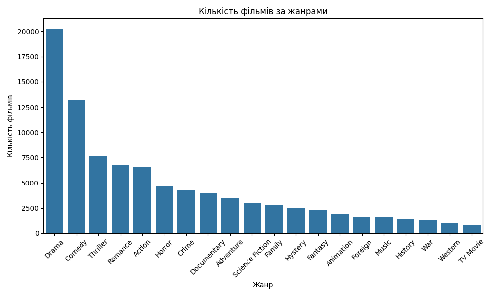
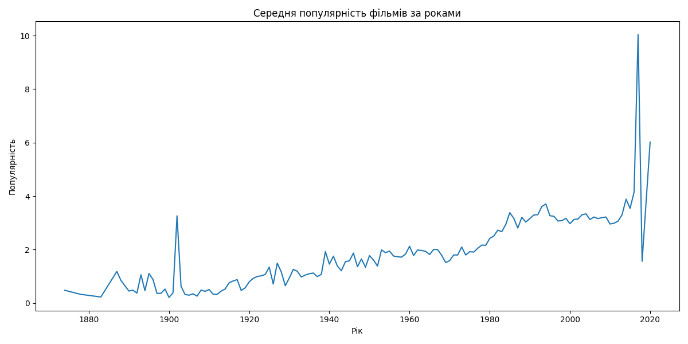
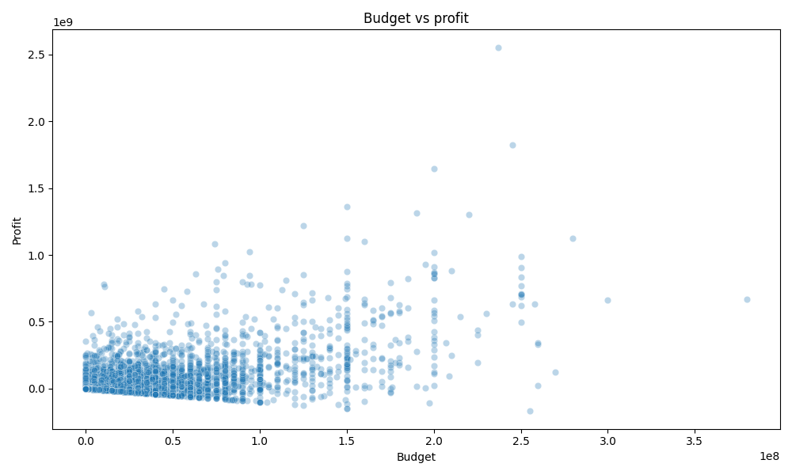

# Films Data Analysis

This project performs the analysis of dataset(movies_metadata.csv) from the information about films.

Goal:   identify key trends,popular genres, 
the relationship between budget and profit,
and also examine changes in the popularity of films over the years.

## Data

Used data set have 45,466 notes and 24 columns.

Main columns:
- `title` : Film name.
- `budget` : Budget.
- `revenue` : Film revenue.
- `release_date` : Release date.
- `genres` : Genres in JSON.
- `popularity` : Popularity.
- `vote_average` : Vote average.


### Data clearing

1. Deleted notations without dates, with incorrect budget or income.
2. JSON format genres are divided into separate lines.
3. Added new columns: `release_year` and `profit`.


## Results

### 1. Popularity of genres
The graph below shows the number of films for each genre.

The most popular genres:
- **Drama**
- **Comedy**
- **Thriller**



### 2.Popularity trends
Over the years, the popularity of movies is growing. 
This can be seen from the graph of the average popularity of films by year:



### 3. Budget and profit
The relationship between budget and profit shows that high-budget films usually make more profitable:



## Як повторити аналіз?

1. **Завантажте репозиторій**:
   ```bash
   git clone https://github.com/ArnDkl341232/FilmAnaliser.git

2. **Встановіть залежності: Переконайтеся, що у вас встановлено Python 3.8+ та бібліотеки:**

    ```bash
    pip install pandas matplotlib seaborn

3. **Запустити скрипт**:
Виконайте `main.py` для автоматичного аналізу:

    ```bash
    python main.py
   
4. **Огляньте результати**:
   Очищений датасет буде збережений як `cleaned_movies_metadata.csv`,
   а графіки - у файлах:
   - `genre_popularity.png`
   - `popularity_trend.png`
   - `budget_vs_profit.png`
   
## Контакти

Якщо у вас є запитання, пишіть на email: hungreman300@gamail.com.

Дякуємо, що зацікавилися нашим проєктом!
